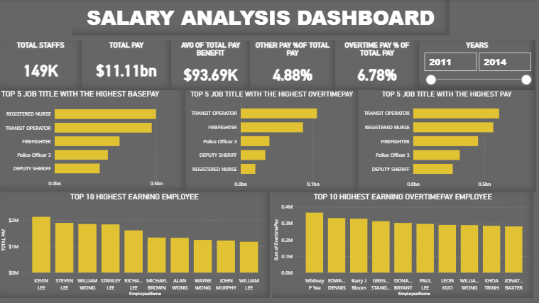

# 💼 Employee Salary Analysis (2011–2014) | Power BI Dashboard

This project explores salary data from 2011 to 2014 to uncover compensation trends, top-earning roles, and overtime-heavy positions. Built using **Power BI**, the dashboard delivers key metrics and visualizations to guide workforce cost optimization and strategic HR decisions.

---

## 🔍 Executive Summary

**🎯 Objective:**  
Analyze employee salary data to identify trends in pay distribution, top-earning roles, and overall compensation structure.

**📌 Key Insights:**
- 👥 Total employees analyzed: **149,000**
- 💰 Total salary paid: **$11.11 billion**
- 📊 Average total pay (including benefits): **$93,690**
- ⏱️ **OvertimePay** accounts for **6.78%** of total pay
- 📦 **OtherPay** contributes **4.88%** of total pay
- 🥇 Top roles in **BasePay**, **OvertimePay**, and **TotalPay** include:
  - **Transit Operator**
  - **Registered Nurse**
  - **Firefighter**

**🛠 Recommendations:**
- Investigate high-overtime roles (e.g., Transit Operators) to optimize labor costs
- Design compensation models that balance reward with workload
- Explore automation or staffing adjustments in overtime-heavy roles

---

## 🧭 Business Context

**Background:**  
The organization aims to evaluate compensation trends from 2011 to 2014, spotlight high-cost roles, and improve pay equity and operational efficiency.

**Stakeholders:**  
HR Department, Finance Team, Senior Management

**Key Business Questions:**
- What are the total and average salary expenditures?
- Which roles have the highest earnings across different pay types?
- Who are the top-earning individuals and outliers?

---

## 🗂️ Data Overview

- **📁 Sources:** Internal HR and payroll records
- **📅 Date Range:** 2011 – 2014
- **🧾 Fields Used:**  
  `EmployeeName`, `JobTitle`, `BasePay`, `OvertimePay`, `OtherPay`, `TotalPay`, `TotalPayBenefits`
- **💡 Data Notes:** Salary values are in USD; names and job titles assumed accurate.

---

## 📊 Dashboard Overview 

**Tool Used:** Microsoft Power BI

### 🖼️ Key Performance Indicators (KPIs):
- **Total Employees:** 149,000
- **Total Pay:** $11.11 billion
- **Avg. Pay + Benefits:** $93.69K
- **OtherPay (% of TotalPay):** 4.88%
- **OvertimePay (% of TotalPay):** 6.78%

---

### 🧑‍💼 Top Job Titles by Earnings

#### 🏆 BasePay
1. Registered Nurse  
2. Transit Operator  
3. Firefighter  
4. Police Officer 3  
5. Deputy Sheriff

#### ⏰ OvertimePay
1. Transit Operator  
2. Firefighter  
3. Police Officer 3  
4. Deputy Sheriff  
5. Registered Nurse

#### 💵 TotalPay
1. Transit Operator  
2. Registered Nurse  
3. Firefighter  
4. Police Officer 3  
5. Deputy Sheriff

---

### 💸 Top Earners

#### 🔟 Top 10 Highest-Earning Employees:
1. Kevin Lee  
2. Steven Lee  
3. William Wong  
4. Stanley Lee  
5. Richard Lee  
6. Michael Brown  
7. Alan Wong  
8. Wayne Wong  
9. John Murphy  
10. William Lee

#### ⏱️ Top 10 OvertimePay Earners:
1. Whitney P Yee  
2. Edward Evans  
3. Dennis Bloom  
4. Barry J  
5. Gregg Strand  
6. Dana Brown  
7. Paul Lee  
8. William Wong  
9. Khoa Trinh  
10. Jonathan Baxter

---

## 💡 Strategic Recommendations

- Review overtime-heavy roles for potential staffing optimization and employee wellness
- Incentivize productivity fairly in high-performing roles like Registered Nurse
- Conduct compensation audits to ensure equity and transparency within high-cost departments

---

## 🧠 Skills & Tools Demonstrated

- Power BI: Data modeling, DAX, interactive dashboards
- Workforce Compensation Analysis
- Overtime and Benefit Cost Evaluation
- Business Insight Communication

---

## 📁 Files Included

- `Salary_Analysis_2011_2014.pbix` – Power BI dashboard file
- `Executive_Summary_Report.pdf` – Insights and visual highlights

---

## 🙋‍♂️ About Me

**Oluwatobi Titilayo**  
Data Analyst | Power BI • Excel • SQL • Python  
[LinkedIn](https://www.linkedin.com/in/titilayo-oluwatobi/) | [GitHub](https://github.com/Oluwatobi-Data)

---

> _“The goal is to turn data into information, and information into insight.” – Carly Fiorina_
